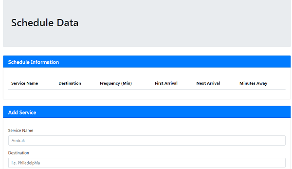
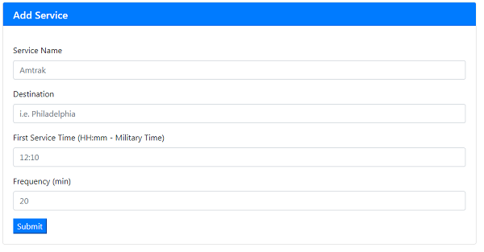
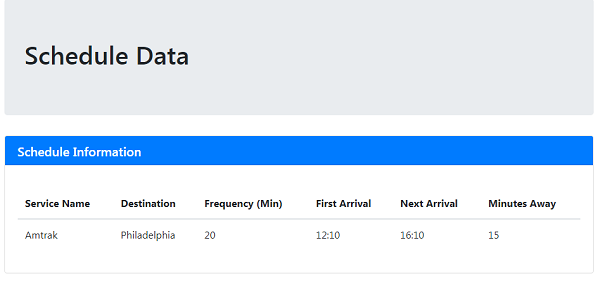

# Scheduler

The purpose of this program is to find out the times for the next service.

The data put in for this form is sent to Firebase and displayed above.

When the data is sent, calculations are done to determine the correct times for the next arrival, as well as the minutes until it arives.
